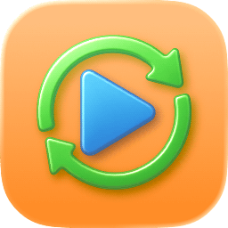
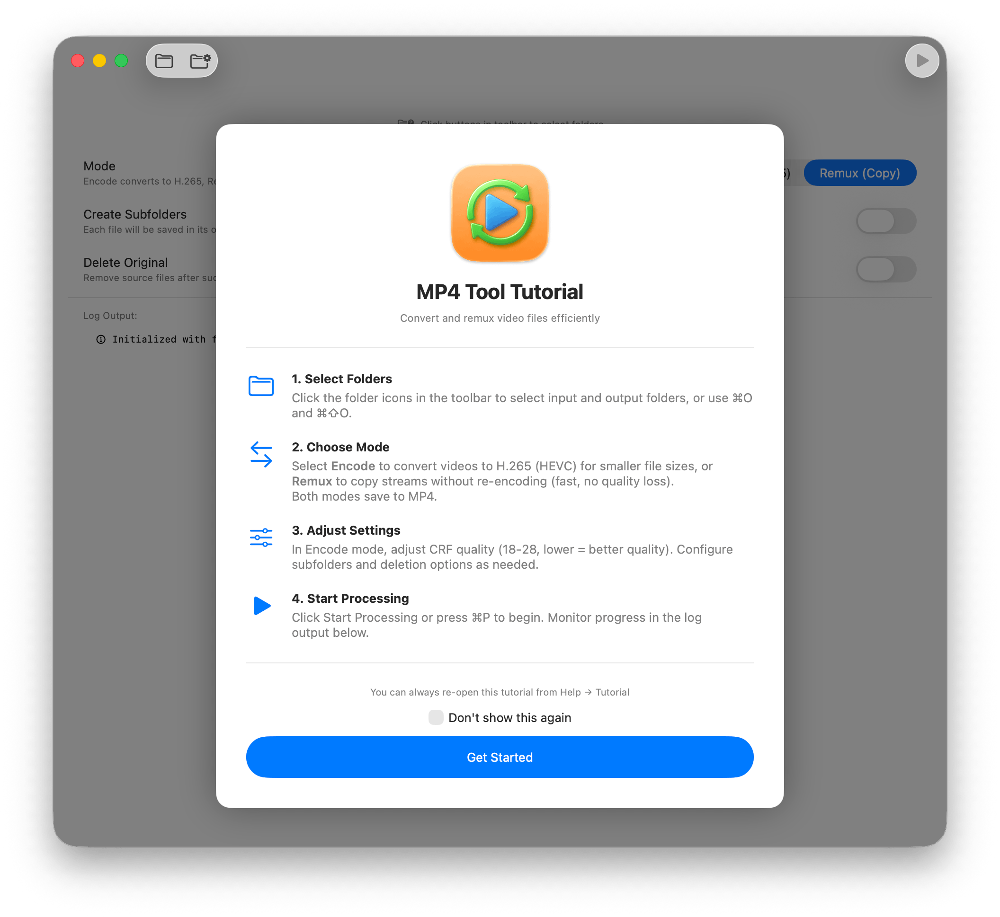
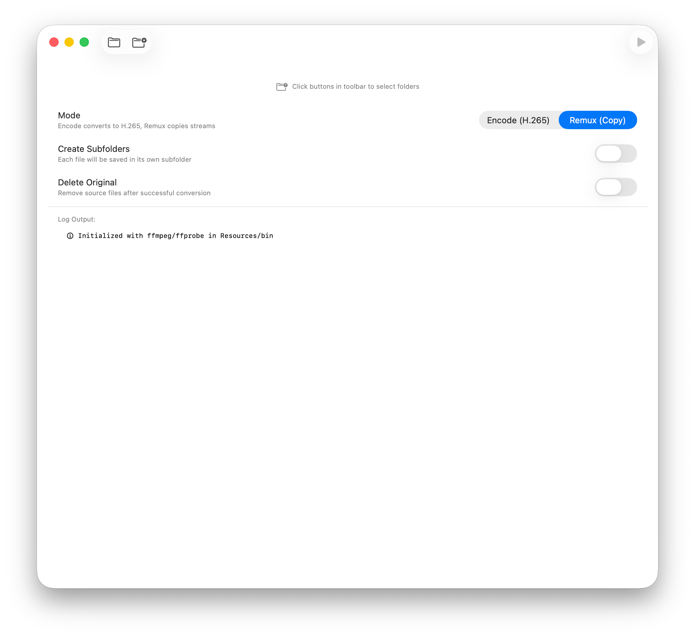
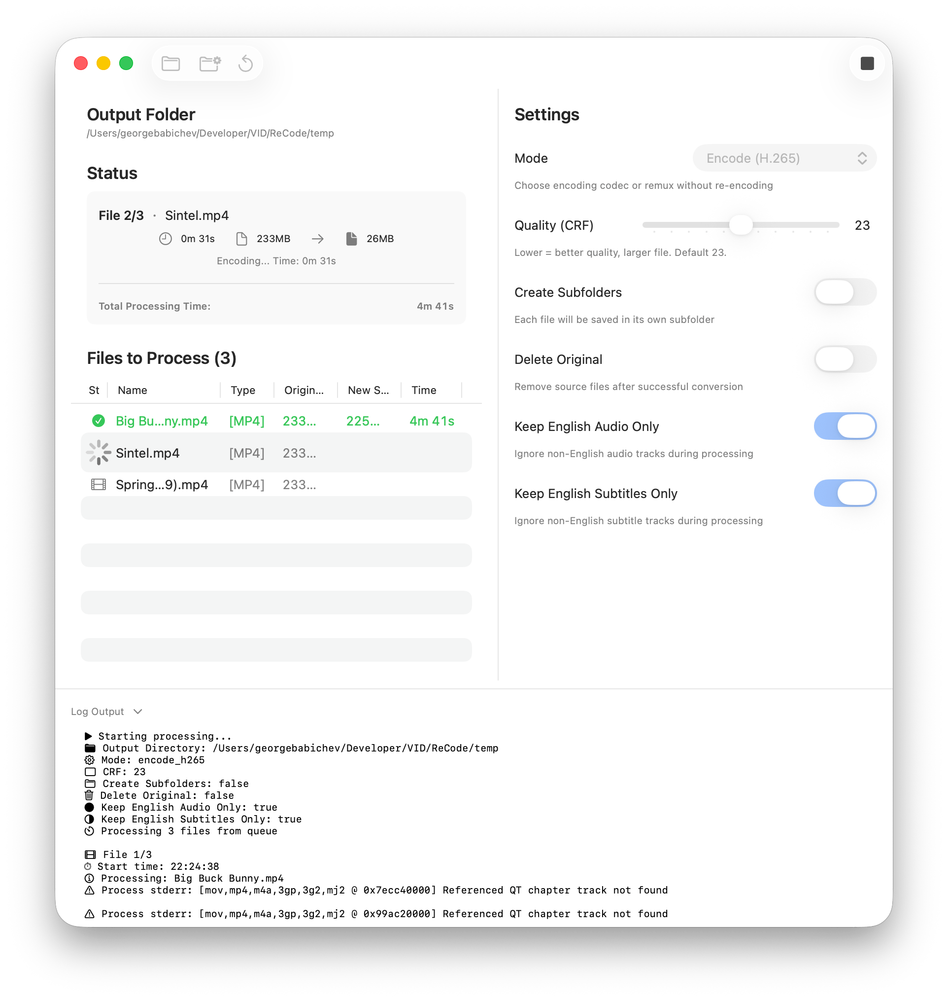

<div align="center">

<picture>
  <source srcset="Documentation/icon-dark.png" media="(prefers-color-scheme: dark)">
  <source srcset="Documentation/icon-light.png" media="(prefers-color-scheme: light)">
  
</picture>
<br/><br/>

<h2>Easily convert video files for native playback on Mac & iOS (and more)</h2>
<br><br>

</div>

<p align="center">
    <a href="Documentation/App1.png"></a>
    <a href="Documentation/App2.png"></a>
    <a href="Documentation/App3.png"></a>

</p>

MP4 Tool is a simple ffmpeg frontend that lets you convert or remux video files into MP4 containers with a streamlined macOS interface.

<b>You must have ffmpeg & ffprobe in your $PATH</b>, or compile the app with ffmpeg & ffprobe in the Resources directory.
<a href="Documentation/build-ffmpeg-arm64.sh">FFmpeg ARM64 Build script is in the repo</a>

## Features 
- Batch Processing.
- H264 & H265 Encoding Support.
- Remux support.
- Customization options to strip out non-english audio & subtitle tracks. 
- System notification support. 
- Thorough logging. 
- Tool for recursively scanning a directory for non-MP4 files. 
- Tool for validating that MP4 files are valid & playable. 

## Tutorial Summary

### 1. Install FFmpeg
- brew install ffmpeg
- or however else you want to do it. 

### 2. Select Folders
- Use the toolbar folder buttons to pick input and output directories. (or drag and drop)
- Keyboard shortcuts: `⌘O` for input and `⌘⇧O` for output.

### 2. Choose Mode
- `Encode`: Converts videos to H.265/H.264 (HEVC) for smaller files while preserving good quality.
- `Remux`: Copies existing streams without re-encoding for a fast, lossless workflow.
- Both modes save results as MP4 files.

### 3. Adjust Settings
- In Encode mode, configure the CRF quality (recommended range 18–28, where lower values produce higher quality).
- Optional settings let you manage subfolders and control whether original files are deleted after processing.
- Optional settings let you remove any non-english Audio tracks and Subtitles. 

### 4. Start Processing
- Click **Start Processing** or press `⌘P` to run the selected jobs.
- Watch progress and logs in the lower section of the window.

## 🖥️ Install & Minimum Requirements

- macOS 14.0 or later  
- Apple Silicon & Intel (Not tested on Intel)
- ~10 MB free disk space  

### ⚙️ Installation

Download from Releases. It's signed & notarized!

### ⚙️ Build it yourself!

Clone the repo and build with Xcode:

```bash
git clone https://github.com/gbabichev/MP4-Tool.git
```

## 📝 Changelog

### 1.2.2
- Enhanced resolution logic. Videos will no longer be upscaled if they are a smaller resolution than requested. 
- Vertical videos are properly processed. 
- Video status will reset if the same batch is re-processed.

### 1.2.1
- Added toggle to switch between bundled FFMpeg & system FFmpeg, if the app is compiled with FFmpeg.

### 1.2.0
- Added Resolution options. Original, 1080, & 720. 
- Added preset quality options from placebo->ultrafast. 

### 1.1.0
- Added batching. You can now drag in additional files to add to an existing processing batch. 
- Enabled settings sidebar to be collapsible. 
- Updated ffmpeg build script. 
- Adjusted quality slider to allow for more quality settings.

### 1.0.0
- Initial Release. 

## 📄 License

MIT — free for personal and commercial use. 

## Credits
Thanks to the FFmpeg team for making an awesome utility. 