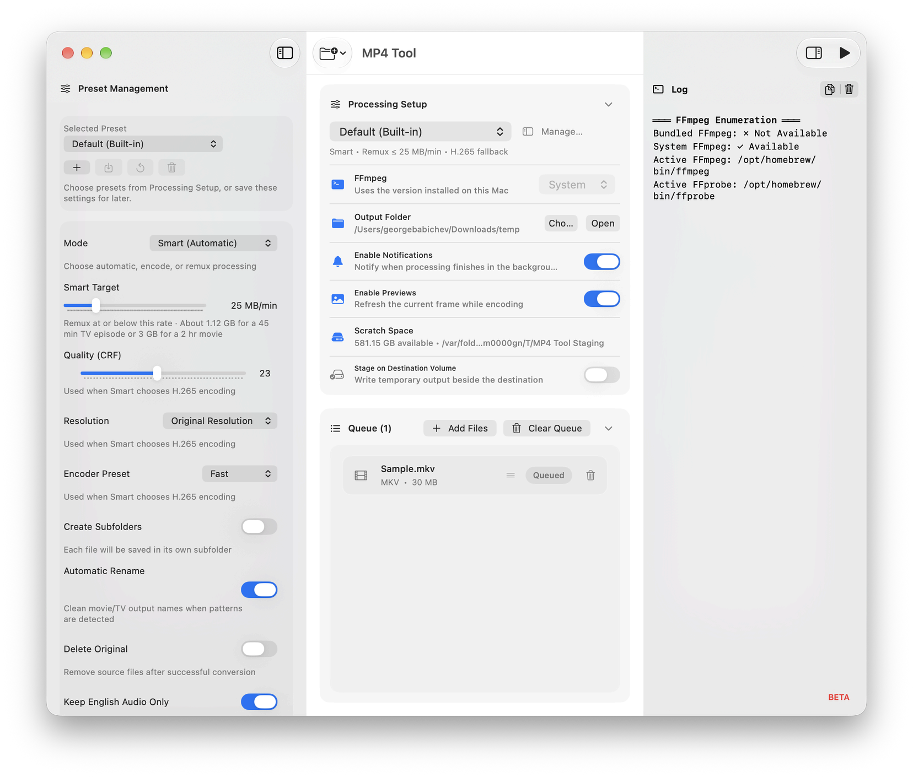
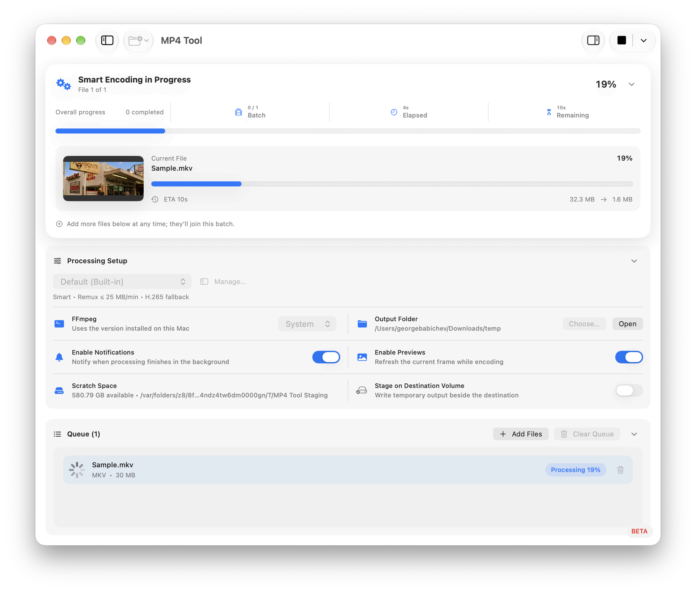
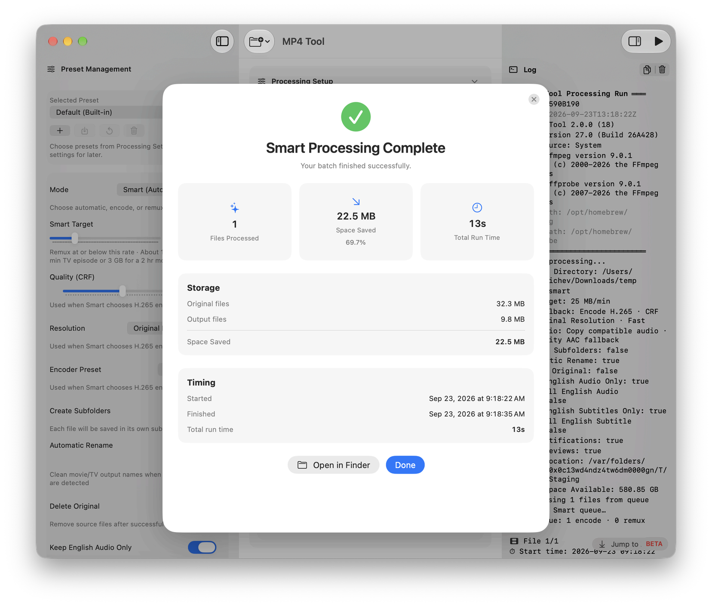

<div align="center">

<picture>
  <source srcset="docs/icon-dark.png" media="(prefers-color-scheme: dark)">
  <source srcset="docs/icon-light.png" media="(prefers-color-scheme: light)">
  
</picture>
<br/><br/>

<h2>Easily convert video files for native playback on Mac & iOS (and more)</h2>
<br><br>

</div>

<p align="center">
    <a href="docs/App1.png"></a>
    <a href="docs/App2.png"></a>
    <a href="docs/App3.png"></a>
</p>

MP4 Tool is a native macOS media-processing app for creating clean,
Apple-compatible MP4 files. It can automatically choose between remuxing and
H.265 encoding, validate every output, inspect or repair existing libraries,
and expose the same processing queue through its command line companion.

<b>FFmpeg and FFprobe are required.</b> MP4 Tool can use a supported system
installation, or the app can be compiled with both binaries in its Resources
directory. An <a href="docs/build-ffmpeg-arm64.sh">FFmpeg ARM64 build script</a>
is included in the repository.

## Features

- Smart processing that automatically chooses remux or H.265 encoding using each file's size and runtime.
- H.264, H.265, and lossless remux workflows with reusable built-in and custom presets.
- Batch queues with live progress, ETA, frame previews, graceful stopping, and validated outputs.
- Intelligent English audio and subtitle selection, including automatic sibling SRT discovery.
- Automatic movie and TV naming, optional matching subfolders, and safe original-file replacement.
- Inspect & Repair checks for Apple compatibility, metadata, timing, subtitles, audio layouts, and clearly degraded audio.
- Track editing, video splitting, non-MP4 scanning, persistent Run History, and rotating logs.
- Configurable post-process scripts with validation-aware failure handling.
- `mp4toolctl` for controlling the app's queue, presets, processing, and status from Terminal or SSH.
- System notifications, configurable staging storage, and protection against system sleep during long runs.

## Built in additional tools

### Inspect & Repair

Recursively scan MP4 files for Apple playback compatibility, unwanted metadata,
timing offsets, subtitle coverage, audio-layout problems, and clearly degraded
audio. Safe repairs are written to temporary files and validated before the
original is replaced. Long scan sessions can be exported and imported later.

### Track Editor

Inspect the video, audio, and subtitle tracks in an MP4. Add external audio or
SRT files, edit track language and accessibility metadata, remove unwanted
tracks, and create a validated replacement without re-encoding compatible media.

### Video Splitter

Find black space around episode boundaries, preview or adjust the proposed split,
and create sequentially named files. Detection thresholds and the scan window are
customizable.

### Scan for Non-MP4 Files

Recursively find common video files that are not already in MP4 containers and
send them directly to the main processing queue.

### Run History

Review completed runs, encode speed, runtime, storage savings, input and output
locations, FFmpeg commands, and post-process diagnostics. Run History also tracks
all-time original size, current size, and total space saved.

## Tutorial Summary

### 1. Install FFmpeg
- brew install ffmpeg
- or however else you want to do it.

### 2. Build the Queue

- Drag video files or folders into the Queue, use Add Files, or choose Open File/Open Folder from the File menu.
- Folders are scanned recursively and pending items can be reordered.
- Choose the output folder from Processing Setup or with `⌘⇧O`.

### 3. Choose a Preset or Mode

- Start with a built-in preset or save your own reusable configuration.
- `Smart`: Measures each file's size against its runtime. Its adjustable storage target defaults to 25 MB per minute; files at or below the target are remuxed, while larger or incompatible files fall back to H.265 encoding.
- `Encode`: Converts video to H.265 (HEVC) or H.264 (AVC) for broad Apple playback compatibility.
- `Remux`: Copies existing streams without re-encoding for a fast, lossless workflow.
- All modes save results as MP4 files.

### 4. Adjust Settings

- Configure quality, resolution, encoder speed, automatic naming, and optional subfolders.
- Choose whether to retain only the preferred English audio and subtitle tracks or every English track.
- Configure notifications, frame previews, staging storage, and an optional post-process script.

### 5. Process and Monitor

- Click **Process** or press `⌘P` to start the queue.
- Follow batch progress, current-file progress, ETA, previews, and storage information.
- Open the Log inspector for detailed FFmpeg output or use Run History after completion.

## Post-Process Scripts

MP4 Tool can run a local script after each successfully processed file or once
after the batch finishes. Choose the script in Processing Setup, then configure:

- **Script Timing:** Run after each successful file or after the batch finishes.
- **On Script Failure:** Mark the run as needing attention, or log a warning and
  continue.
- **Script Timeout:** Stop scripts that do not finish within the selected time.

Use **Test** to verify that the script can launch. Test runs receive
`MP4_TOOL_POST_PROCESS_PHASE=test` and no media paths. Use **Reveal** to show the
selected script in Finder.

Post-process scripts run only after MP4 Tool has created and validated the final
output. When **Delete Original** is enabled, MP4 Tool keeps the original until the
configured script succeeds. A per-file script failure retains that file's source;
end-of-batch timing defers all source deletions until the batch script succeeds.

### Per-file script contract

The default positional arguments are:

```text
script input-file output-file
```

The script also receives:

```text
MP4_TOOL_POST_PROCESS_PHASE=item
MP4_TOOL_MODE=<effective processing mode>
MP4_TOOL_INPUT_FILE=<source path>
MP4_TOOL_OUTPUT_FILE=<validated output path>
MP4_TOOL_OUTPUT_DIR=<output file's directory>
MP4_TOOL_FILE_NAME=<output file name>
MP4_TOOL_POST_PROCESS_SCRIPT=<selected script path>
```

Its working directory is the output file's directory.

### End-of-batch script contract

For ordinary batches, the existing positional contract is preserved:

```text
script output-directory output-file-1 output-file-2 ...
```

Every end-of-batch run also receives `MP4_TOOL_MANIFEST_FILE`, which points to a
temporary JSON document containing the phase, processing mode, output directory,
and the input path, output path, and file name for every successful item. For
large batches, MP4 Tool passes only the output directory and manifest path as
positional arguments to avoid macOS process argument limits.

```text
MP4_TOOL_POST_PROCESS_PHASE=end
MP4_TOOL_MODE=<selected batch mode>
MP4_TOOL_OUTPUT_DIR=<batch output directory>
MP4_TOOL_OUTPUT_COUNT=<successful output count>
MP4_TOOL_MANIFEST_FILE=<temporary JSON manifest path>
MP4_TOOL_POST_PROCESS_SCRIPT=<selected script path>
```

For batches small enough to use positional arguments, `MP4_TOOL_OUTPUT_FILES` and
`MP4_TOOL_INPUT_FILES` are also supplied as newline-separated values. Scripts
intended for very large batches should read the manifest instead.

MP4 Tool supports executable files plus `.sh`, `.bash`, `.zsh`, and `.py`
scripts. Standard output, standard error, exit status, runtime, timeout status,
and diagnostics are written to the processing log; results are also stored in
Run History. Captured output is bounded so a noisy script cannot grow memory or
the persistent log without limit. Immediate Stop also terminates the active
post-process script.

## Command Line Tool

Install `mp4toolctl` from **MP4 Tool > Install Command Line Tool…**. MP4 Tool
must be open in the same macOS user session because the command line tool
controls the app's queue, presets, and processing engine rather than maintaining
a separate encoder configuration.

List and select the same presets shown in the app:

```bash
mp4toolctl presets
mp4toolctl use "Default"
```

Queue files or folders, then start them with the current app settings:

```bash
mp4toolctl add "/path/to/movie.mkv"
mp4toolctl add "/path/to/folder"
mp4toolctl start
```

For a self-contained run, supply a preset and output folder. Omit either option
to keep its current value in the app:

```bash
mp4toolctl run --preset "Default" --output "/path/to/output" "/path/to/input"
```

Inspect and follow processing:

```bash
mp4toolctl queue
mp4toolctl status
mp4toolctl status --watch
mp4toolctl wait
```

`wait` exits with a failure status when the completed run needs attention, which
makes it suitable for shell scripts. Add `--json` to any command for structured
output; `status --watch --json` emits one JSON object whenever status changes.

Stop immediately, stop safely after the active file, or cancel a pending safe
stop:

```bash
mp4toolctl stop
mp4toolctl stop --after-current
mp4toolctl resume
```

Use `mp4toolctl clear` to empty the queue while it is idle. Existing commands
from earlier releases, including `add --start`, remain supported. Run
`mp4toolctl help` for the complete command summary.

## 🖥️ Install & Minimum Requirements

- macOS 14.0 or later
- Apple Silicon & Intel (Not tested on Intel)
- ~10 MB free disk space

### ⚙️ Installation

Download from Releases. It's signed & notarized!

### ⚙️ Build it yourself!

Clone the repo and build with Xcode:

```bash
git clone https://github.com/gbabichev/MP4-Tool.git
```

## 📝 Changelog

### 2.0.0

This is a major update focused on smarter processing, safer outputs, improved
Apple compatibility, and a redesigned native macOS interface.

#### Smart processing and presets

- Added Smart Mode, which chooses between remuxing and H.265 encoding based on each file's size and runtime.
- Smart Mode uses an adjustable storage target of 25 MB per minute by default.
- The Default preset now uses Smart Mode.
- Added reusable custom presets and new built-in presets for fast H.264, fast H.265, animation, space-saving 720p, and remux workflows.
- Added modified-state indicators for the active preset and each individual setting that differs from it.
- Improved preset reset behavior and made it easier to move between presets while editing.
- Improved Smart Mode progress and ETA estimates by accounting for files that only require a quick remux.

#### Better audio handling

- Compatible AAC, AC-3, E-AC-3, and ALAC audio can now be copied without quality loss during video encoding; MP3 and other incompatible audio use the high-quality AAC fallback.
- Improved support for mono, stereo, 5.1, 6.1, and 7.1 channel layouts.
- MP4 Tool now prefers one complete main English audio track by default while avoiding commentary, audio-description, dubbed, and incomplete tracks.
- Added an option to retain every English audio track.
- Added automatic recovery for audio tracks that become truncated during encoding.
- Added conservative low-quality audio reporting to Inspect & Repair.

#### Smarter subtitle selection

- MP4 Tool now selects one best English subtitle track by default.
- Selection prefers full ordinary English subtitles, then full English SDH subtitles, and finally forced-only subtitles.
- Cue counts and accessibility markers help identify poorly labelled subtitle tracks.
- Embedded subtitles take priority over external files.
- Matching sibling SRT files are automatically embedded when no usable internal subtitle exists.
- Improved subtitle language, title, role, and default-track metadata for Apple playback.
- Added handling for malformed or unusually long subtitle durations.
- Long encodes now process video and audio first, then add subtitles with a fast separate remux to avoid premature FFmpeg completion.

#### Inspect & Repair

- Replaced several separate utilities with a unified Inspect & Repair window.
- Added dedicated checks for Apple playback compatibility, unsupported auxiliary data tracks, audio and channel-layout problems, low-quality audio, redundant English tracks, unwanted metadata, playback timing offsets, and missing or incorrectly labelled English subtitles.
- Added safe in-place repairs with validation before replacing the original.
- Improved cancellation behavior, particularly when working across slower network shares.
- Added clear result counts, filtering, labelled actions, individual removal, and Reset All across every tab.
- Removed selection controls from subtitle findings that do not support automatic repair.
- Added CSV session export and import, including completion state, so long scans can resume without scanning the library again.
- Accelerated compatibility scans by performing expensive subtitle inspection only when track metadata is inconclusive.

#### Track Editor

- Added Track Editor for inspecting and modifying individual video, audio, and subtitle tracks.
- Added external audio and SRT subtitles using the file picker or drag and drop.
- Added editing for language, title, default, forced, and accessibility properties.
- Track titles can now be explicitly cleared.
- Improved handling of malformed subtitle timing during remuxes.
- All edited outputs are validated before replacing their originals.

#### Run History and diagnostics

- Added persistent Run History with start and completion times, runtime, encode speed, original and output sizes, storage saved, processing mode, file locations, complete FFmpeg commands, and per-file details.
- Added an all-time storage summary showing original size, current size, and total space saved.
- History entries can be selected, inspected, and deleted.
- Added persistent rotating processing logs.
- Redesigned the Log inspector with wrapping, semantic colors, copy controls, and Jump to Latest.

#### Command line tool

- Expanded `mp4toolctl` into a controller for the same queue, presets, settings, and processing engine used by the app.
- Added `presets` and `use` commands for listing and selecting app presets.
- Added `run` for starting files or folders with an optional preset and output folder in one command.
- Added `queue` and richer `status` output with progress, ETA, processing mode, result counts, active preset, output folder, and FFmpeg availability.
- Added `status --watch` for live terminal monitoring and `--json` for automation-friendly output.
- Added `wait`, including a failure exit status when a completed run needs attention.
- Added `stop --after-current` and `resume` for requesting or cancelling a graceful stop.

#### Post-process scripts

- Reworked post-process scripts with dedicated Test and Reveal controls.
- Scripts can run after each successful file or once after the batch finishes.
- Added configurable failure policies and timeouts.
- Added documented environment variables and per-file positional arguments.
- Added JSON manifests for large end-of-batch runs, avoiding macOS process argument limits.
- Added script exit status, runtime, output, errors, timeout state, and diagnostics to the processing log and Run History.
- Original files are retained until required post-processing succeeds, and immediate Stop terminates an active script.
- Removed the confusing legacy advanced-script interface.

#### Processing safety and reliability

- Added comprehensive output validation for stream presence, duration, readability, audio integrity, and truncated output.
- Improved support for unusual and malformed files from the FFmpeg test suite.
- Added safer handling for missing video or usable audio tracks.
- Added configurable staging storage, available-space reporting, and abandoned temporary-file cleanup.
- Added pending queue reordering and inline removal.
- Added Stop After Current File, plus the ability to cancel that pending stop.
- Improved immediate cancellation and FFmpeg process termination.
- Prevented macOS from sleeping during active processing.
- Added a quit warning while processing is active.
- Improved output-folder availability checks.
- Automatic naming now applies consistently to both output files and generated subfolders.

#### Interface improvements

- Rebuilt the main app and Inspect & Repair using native, responsive macOS split views.
- Added collapsible Processing Setup, Progress, and Queue sections whose state is remembered.
- Redesigned progress reporting with a compact layout, previews, batch progress, current-file progress, ETA, and storage information.
- Added richer completion summaries and an Open in Finder action.
- Standardized controls, selection behavior, stop buttons, toolbar separators, cards, and colors across tools.
- File and folder dialogs now open as native sheets attached to their parent windows.
- Added native safe-area bars and toolbar-edge scrolling materials to the Preset Management sidebar and Log inspector.
- Improved layouts for smaller windows and responsive sidebars.
- Improved Video Splitter and Track Editor descriptions and controls.
- Refreshed the About window.
- Added native Dock behavior for reopening the main window.
- Fixed completion-overlay presentation on newer macOS releases.
- Improved performance for large queues, scans, and result tables.


### 1.8.2
- Fixed UI lag when adding items to the table.
- Split the apps queue. If CLI tool is installed, the UI and the CLI share the same queueu (single window). If CLI is not installed, you can have multiple windows with independent queues.

### 1.8.1
- Fixed app lifecycle. UI will no longer clear files added via CLI.

### 1.8.0
- Added a setting to run a post-processing script.
- Added a CLI tool to manage the local app queue.

### 1.7.0
- Added support encoding audio only.
- Improved reliability of the remux tool to capture codec errors on Apple platforms.
- Improved reliability of the MP4 Validator tool to capture code errors on Apple platforms.
- Improved video splitter tool. We cut at nearest keyframe now, to avoid sync issues.

### 1.6.1
- Settings sidebar is now scrollable, so the app can fit better on smaller displays.
- Updated ffmpeg build script to support 8.1

### 1.6.0
- Added automatic file naming for Movies & TV Shows, stripping out junk.
- Added a "clear" button to the results table.

### 1.5.0
- Added 'Subtitle Merger' tool. Lets you select an MP4 & SRT, and merge them to a single file. Supports multiple languages.
- Added online update checker. Checks github for the latest release.

### 1.4.1
- Fixed:
  - App Hang in certain conditions.
  - Notifications clearing incorrectly.
  - Total ETA being off.
- Added:
  - Output folder is now remembered across app restarts.

### 1.4.0
- Added Offset Tool
  - Scan a directory, and output if videos have significant offsets (meaning they don't start at true 0)
  - Repair in place.
  - Offsets can happen when splitting a video not on a keyframe and not re-encoding.
- Enhanced Video Splitter to also repair offsets after a split.
- Added UI for "Validate MP4" & "Scan for Non-MP4" Tools.
- Added "Open in Finder" buttons to all folder selections.

### 1.3.1
- Video Splitter Enhancements:
  - If a split is not found, the video is now added to the list requiring manual input.
  - Added select all / deselect all buttons.
  - Added halfway mark to display so you can at a glance validate that the split passes a gut check.
  - Adjusted regex for renaming.
  - Settings pane is now collapsible to increase the size of the results table.

### 1.3.0
- Added Video Splitter tool.
 - Video Splitter takes a single MP4 file which contains multiple episodes, finds black space in the middle and splits the file into two episdoes while automatically renaming.
- Added support for multiple MP4 Tool Windows, so you can do a video action & use tools at the same time.

### 1.2.3
- Added DTS Review support. Apple platforms cannot natively play DTS, therefore we now check for it and throw an error.
 - App now throws errors in remux mode if DTS Audio is detected. DTS is not compatible on Apple Platforms.
 - Validate MP4 Files tool now throws an error if DTS audio is deteceted.

### 1.2.2
- Enhanced resolution logic. Videos will no longer be upscaled if they are a smaller resolution than requested.
- Vertical videos are properly processed.
- Video status will reset if the same batch is re-processed.

### 1.2.1
- Added toggle to switch between bundled FFMpeg & system FFmpeg, if the app is compiled with FFmpeg.

### 1.2.0
- Added Resolution options. Original, 1080, & 720.
- Added preset quality options from placebo->ultrafast.

### 1.1.0
- Added batching. You can now drag in additional files to add to an existing processing batch.
- Enabled settings sidebar to be collapsible.
- Updated ffmpeg build script.
- Adjusted quality slider to allow for more quality settings.

### 1.0.0
- Initial Release.

## 📄 License

MIT — free for personal and commercial use.

## Credits
Thanks to the FFmpeg team for making an awesome utility.
